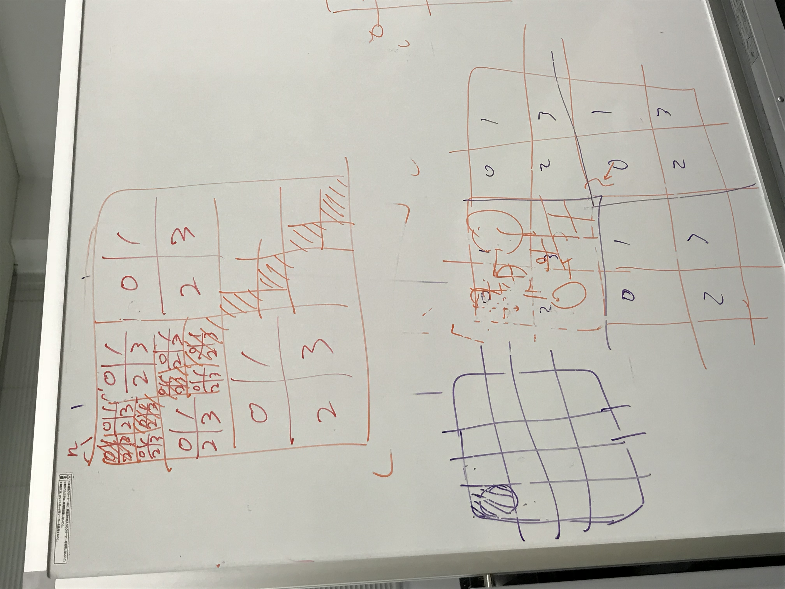

# Logs and conclusions

Logs and conclusions for meetings taking place:

** 8 Aug 2018 **

Meeting between Sameer and Peter.

Make a simple MPI code for the current class structure.

The code will have the following features:
* Make a basic code that is split across 4 processes.
* Don't make it block cyclic. Instead, keep it cyclic and simply split 4 blocks across 4 processes.
* If there is further split down any level, it stays on the same processor.
* We do not handle recursively split multi-process blocks at this point of time.
* Run this through Yokota sensei and set timeline.

** 9 Aug 2018  **

Meeting between Sameer and Yokota-sensei.

We improved on yesterday's discussion between Sameer and Peter. Yesterday
we had thought of two ways of implementing the splitting: one kind of matrix
block is distributed and the other one is not. The one which is not distributed
is too small to qualify for distribution and therefore we need to split it accoross
many processes, we can just compute it on a single process and distribute the results.

However, Yokota-sensei pointed out that this can lead to imbalance since only a corner
process will be kept busy and all the others will need to wait for the communication from it.

He suggested a new way of looking at it:
* Only distribute the full rank matrices until it no longer makes sense to distribute
them further.
* Never compute a full LU decomposition of a subdivided block only on a single process.
Always keep the decomposition distributed.
* Since it does not seem efficient to distribute the low rank block accross processes,
duplicate the low rank block and the reduction across all the processes. The communication
from the full rank blocks (for the L and U parts) will then basically be a broadcast of the
computed blocks to all the processes so they do the (duplicated) computation by themselves.

Here's a photo of the whiteboard:

# Contribution guidelines

Document all the classes/functions you write. Follow this guide:
